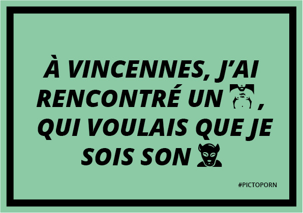
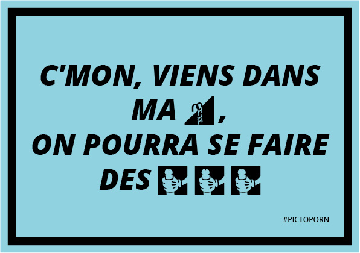
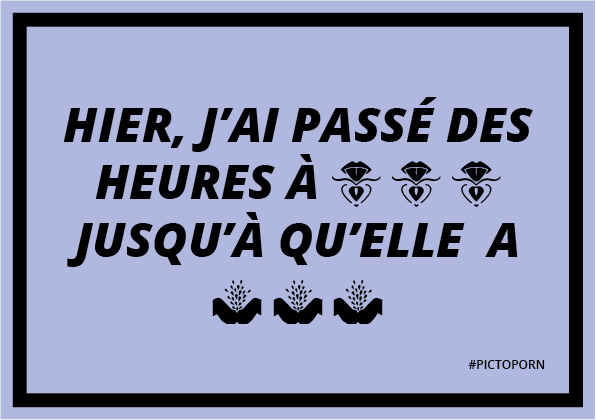
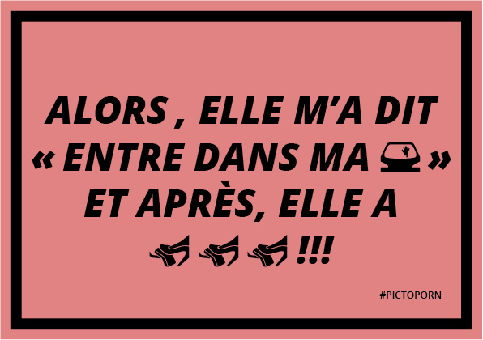

##Pictoporn

This is the result of a workshop conducted during the summer of 2015.

A 4 days long collaborative workshop organized with [La Générale](http://lagenerale.fr/). We developped an incomplete pictogram librairy representing the tags in porn movies. Read a long article (in french) on [ActuaLitte](https://www.actualitte.com/article/reportages/velvetyne-la-fonderie-a-caracteres-libre-met-le-porno-en-images/58844).

There is [a specimen website](http://velvetyne.fr/pictoporn/) allowing to search porn with the pictograms.

## Licence

[GNU GPL](http://www.gnu.org/licenses/gpl-3.0.fr.html)

##This project involved :

Julien Imbert, Martin Desinde, Raphaël Bastide, Jérémy Landes, Fatma Laadhari, Ludovic Laurent, Paul Couture, Georges Khayat, Louise Robert, Zoé Ballet, Jules Romier, Anaïs Djouad, Ariel MARTÍN PÉREZ, Auriana Beltrand, Jean-David Minseroux, Emmanuelle Lubaki, Timothée Chiron, Y-Lan Lucas, Thibault Proux, Zoé Tullen, Gabrielle Meistretty, Alizée Depin, Alice Martins, Cannizzo Margot, Timothée Goguely, Stéphanie Lebon, Bilal Kilani, Thibéry Maillard, Marie Diologent, Noémie Vasak.